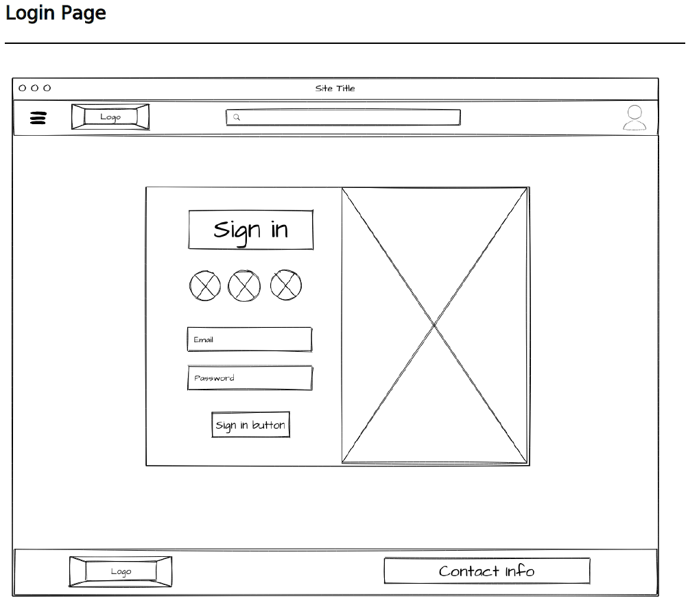
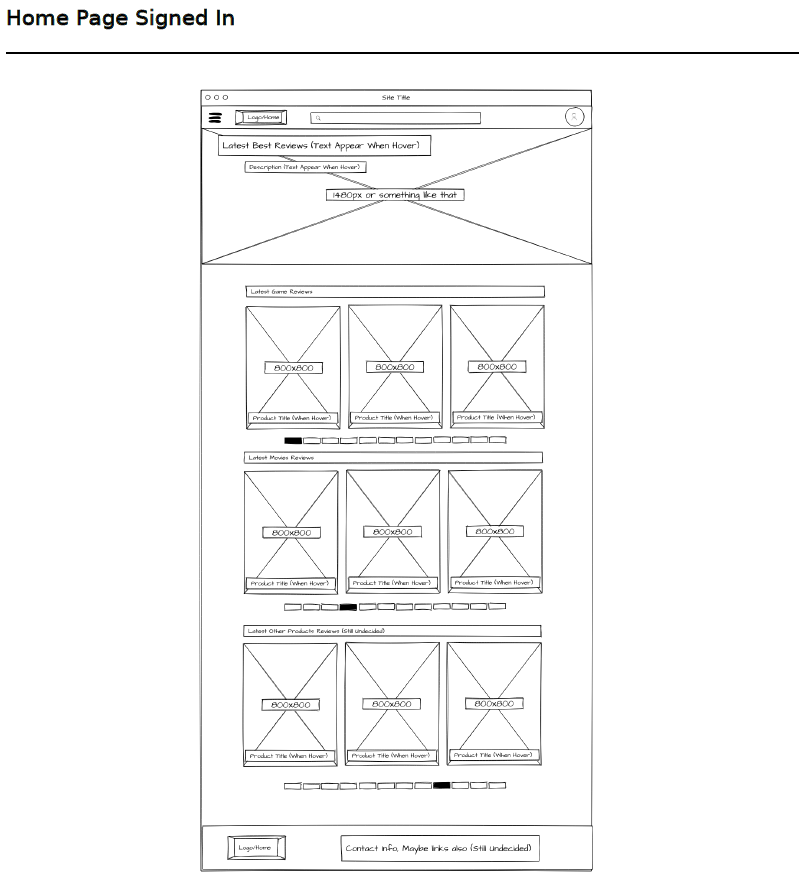
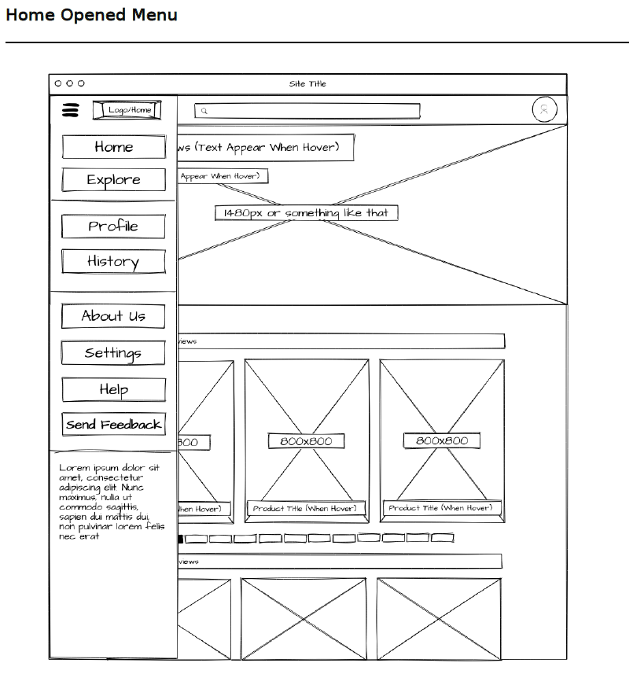
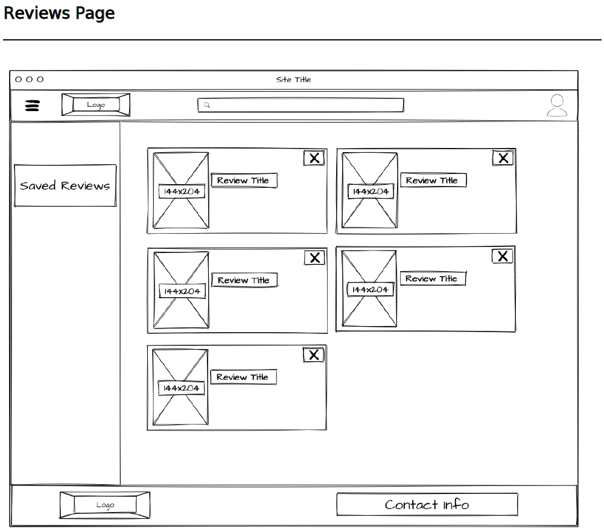
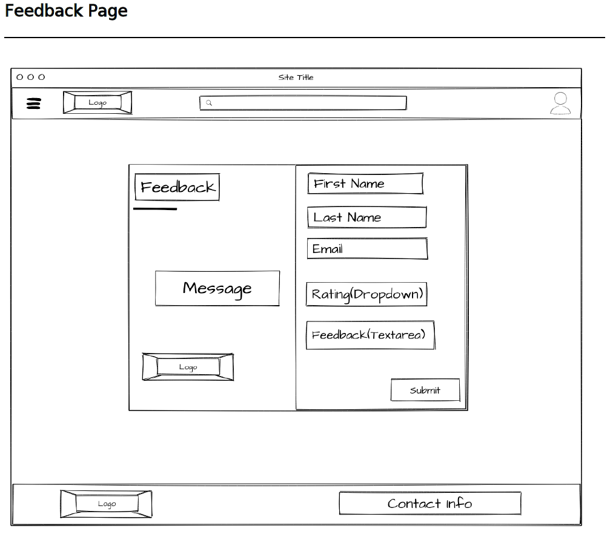
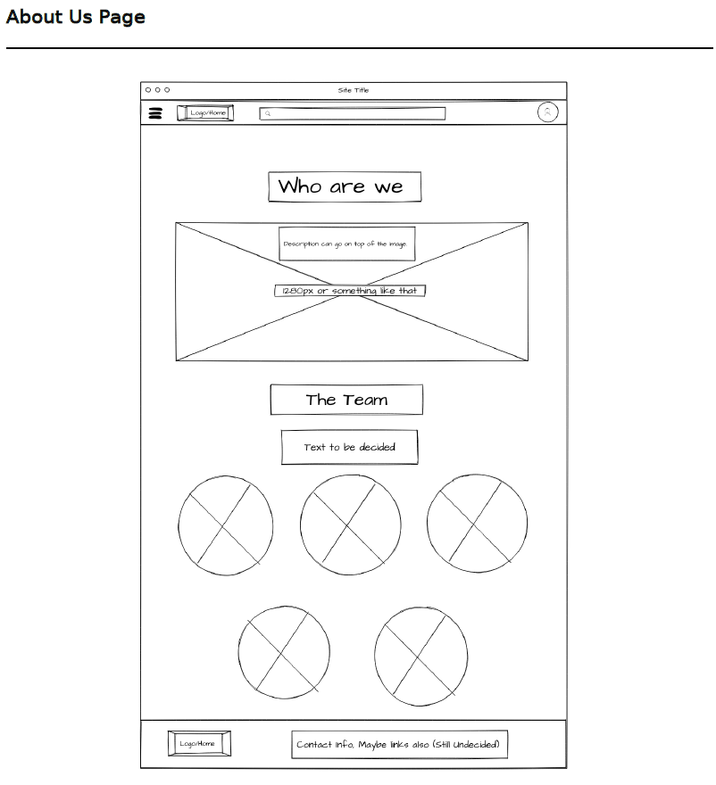
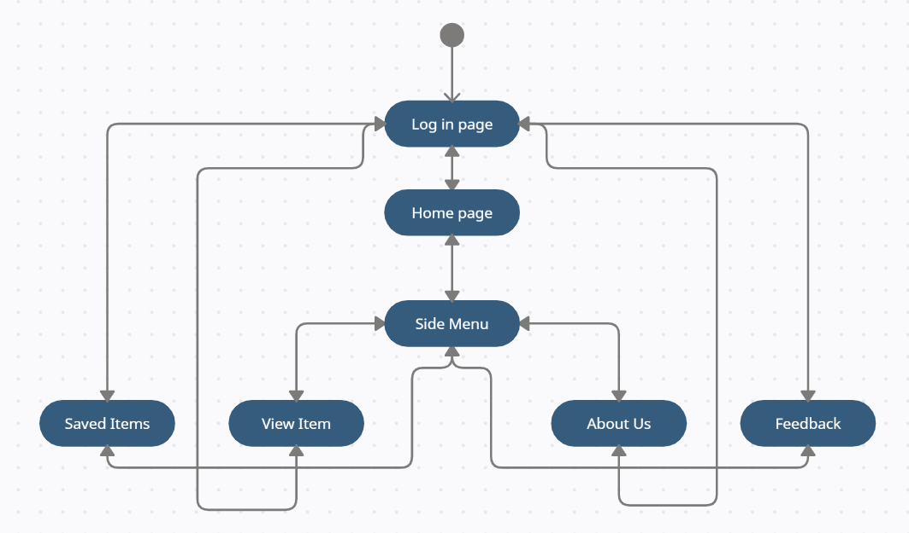

## Task 1.1:
* Many people are confused when they need to choose between games or movies to watch or to buy, is it good? does it worth to buy? what did the other people said about it?
So we are creating a web application called **Ask The Lads**  to make it easier for them and to solve this **problem**. The idea of this web application is to give the user the ability to see other people reviews about different games, movies or animes. The user can also add a comment with his openion after watching or playing to help the other people.

## Task 1.2:
  * Risks:
    * The stakeholders may request a change for all the website design.
    * Since we are working together in a group, we will face code conflicts when we push our work to github.
    * Since there are more than one person working together, we might disagree on an idea while we are impleminting the project
    * We might faco some timing issues becuse we are still students.

## Task 1.3:
* Requirements:
  * System must have a login system (E-mail and password).
  * System must give the ability to add a comment on the items.
  * System should make you able to get back to the home page from all pages.
  * System must give the ability to save an item and view it later and also the ability to remove it.
  * System should be able to transfer the user to the original item trailer.
  * System should give the ability to send a feedback form.
  * Every item should has a describtion and two images (Hero and regular).
* Local Starage design and the wierframe:

The objects in the website and their attributes:

1- Item to review:

Attribute | Datatype
-|-
categore | text
objectDiscreption | text
objectHero | src img
objectImg | src img
objectLink | src html
objectName | text
trailer | url

2- Saved Items:

Attribute | Datatype
-|-
objectName | text
objectImg | src img
objectLink | src html
categore | text

3- User:

Attribute | Datatype
-|-
email | email
password | text / password

Wireframe:

* Activity Diagram:

* Coding and implementation technique:
  * Agile methodology: it is a form of project management approach that is mostly used in software development and in which needs and solutions emerge from the collaborative efforts of self-organizing and cross-functional teams as well as their clients.
  * Agile is a set of ideas that place a premium on adaptation and flexibility. Agile focuses on enabling teams to produce in manageable increments in order to enable greater responsiveness to changing business demands.

* Testing technique:
  * Black box testing: it is a software testing approach in which the tester is unaware of the internal structure, design, or implementation of the object being tested. These tests might be functional or non-functional, however functional tests are more common.